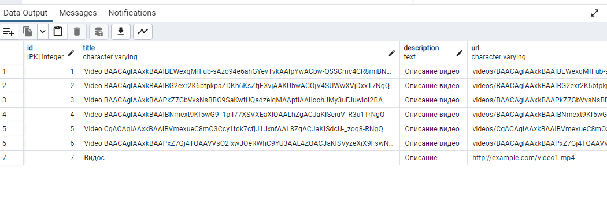

# Практическая работа 0

## 1. **Выбор темы для DSS**

**Тема:** Разработка приложения для быстрого распознавания и поиска объектов на видеоизображении в социальных сетях.

Это приложение будет позволять пользователю загружать видео, которое будет обрабатываться с помощью алгоритмов распознавания объектов, а затем искать видео по распознанным объектам. Пользователи смогут найти видео, соответствующие определенному запросу по объектам.

**Задачи:**
- Загружать видео.
- Производить распознавание объектов на видео.
- Хранить видео и результаты распознавания объектов в базе данных.
- Осуществлять поиск видео по объектам (например, поиск всех видео с объектами "person", "car", "dog" и т.д.).

## 2. **Создание репозитория для работы над DSS**    
[Ссылка на репозиторий](https://github.com/EgorBelov/social-video-object-recognition "Репозиторий")

## 3. **Выявление первоначальных требований к DSS** 

Требования к системе — это базовые функциональности, которые должны быть реализованы.
- Распознавание объектов на видео - система должна распознавать различные объекты (например, людей, автомобили, животных) на видео.
- Поиск видео с объектами - возможность поиска по видеоконтенту на основе заданных критериев, таких как тип объектов (например, человек, машина) и временные метки.
- Фильтрация результатов - возможность сортировки и фильтрации видео по различным параметрам, например, по времени, местоположению, платформам (Telegram, VK).
- Аналитика и выгрузка данных - возможность создания отчетов и аналитических сводок на основе результатов поиска.
- Интеграция с социальными сетями - взаимодействие с социальными платформами (например, Telegram, VK) через их API для извлечения данных.

## 4. **Создание модели предметной области (Ubiquitous Language)**  
    
Сущности системы:
- Модель Video:
    - id: уникальный идентификатор видео (генерируется автоматически).
    - title: название видео.
    - description: описание видео.
    - url: путь к видеофайлу.
    - platform: платформа, с которой видео было загружено (например, Telegram).
    - timestamp: время загрузки видео.
    - hash: хэш-сумма видео для предотвращения дублирования видео в базе данных.
- Модель Object:
    - id: уникальный идентификатор объекта.
    - label: метка объекта (например, "person", "car" и т.д.).
    - confidence: уверенность модели в распознавании объекта.
    - video_id: идентификатор видео, с которым объект связан.
    - count: количество раз, когда этот объект был распознан в видео.
- Платформа (Platform):  
    Поля: ID, название (например, Telegram, VK), параметры доступа (например, ключи API).
- Пользователь (User):   
    Поля: ID, имя, запросы, сохраненные видео.

Глоссарий (Ubiquitous Language):
- Объект — любой элемент, который система должна распознать на видео (например, люди, автомобили).
- Видео — это исходный материал, на котором производится распознавание.
- Запрос — поисковая операция, инициируемая пользователем для нахождения видео с определенными объектами.
- Распознавание – процесс обработки видео с целью выявления объектов с использованием модели YOLO.
- Хэш-сумма – уникальный идентификатор для видео, используемый для предотвращения обработки одного и того же видео несколько раз.

### На данном этапе реализовано(необходимое имеющемуся функционалу):  

### Реализация моделей  

## 5. **Выбор инструментария для реализации DSS**
- Язык программирования:
    * Python — это один из самых популярных языков для работы с данными и машинным обучением. Он хорошо поддерживает библиотеки для компьютерного зрения, взаимодействия с API и асинхронную обработку.

- Для распознавания объектов:
    * OpenCV — для работы с видео.
    * TensorFlow или PyTorch — для распознавания объектов с помощью предобученных моделей.
    * YOLO или SSD — популярные архитектуры для распознавания объектов в реальном времени.

- Для работы с API социальных сетей:
    * Telegram:
        python-telegram-bot — для создания бота в Telegram, который будет взаимодействовать с пользователями.
    * VK:
        vk-api — для взаимодействия с API ВКонтакте.
    * Requests или aiohttp для асинхронных запросов.

- Для работы с базой данных:
    * PostgreSQL или MongoDB для хранения данных о видео и результатах поиска.
    * SQLAlchemy для ORM или PyMongo для работы с MongoDB.

- Для тестирования:
    * pytest для unit, integration и e2e тестов.

- Для контейнеризации:
    * Docker для контейнеризации приложения и БД.
    * Docker Compose для управления многоконтейнерными приложениями (например, приложение + БД).

## 6. **Выбор модели данных для реализации DSS**   
На уровне приложения:
- Взаимодействие между ботом и пользователем через API Telegram.
- Система обработки видео (например, загрузка, анализ).  

На уровне хранения:
- Хранение метаданных видео, например, название файла, формат, длина.
- Результаты анализа — список объектов, распознанных на видео.
- Логи ошибок, если видео не удается обработать.

## 7. **Реализация первоначальных требований к DSS**

В рамках разработки API для нашей DSS, было реализовано несколько эндпоинтов для работы с видео и поиска видео по объектам. Эти эндпоинты предоставляют возможность добавлять видео в систему, получать информацию о видео, а также искать видео по распознанным объектам. Все запросы выполняются асинхронно, что повышает производительность и обеспечивает эффективное взаимодействие с пользователем.

### Создание видео (POST запрос)

Этот эндпоинт позволяет создать запись о видео в базе данных, получая информацию о видео, такой как название, описание, URL и платформу. Он сохраняет эту информацию в базе данных и возвращает объект, который был добавлен.

### Получение информации о видео (GET запрос)

Этот эндпоинт позволяет получить подробную информацию о видео по его ID. Он возвращает данные, связанные с видео, такие как название, описание, URL и дата добавления.

### Поиск видео по объекту (GET запрос)

Этот эндпоинт позволяет искать видео по распознанным объектам, которые были связаны с видео. Например, пользователь может искать все видео, в которых был распознан объект "person". В ответ система отправляет список видео с метками объектов и количеством их встреч.

## 8. **Тесты**

Интеграционные тесты проверяют взаимодействие между компонентами системы, например, между API и базой данных. Мы будем проверять, что эндпоинты корректно обрабатывают запросы и работают с базой данных.

End-to-end тесты проверяют систему в целом, имитируя действия пользователя. Мы будем проверять полный процесс, начиная с загрузки видео и заканчивая получением видео с распознанными объектами.

# Практическая работа 1

## 1. **Подключить async-runtime к Вашей DSS**

Cуществующие методы API используют асинхронные возможности (например, async и await).

В проекте также используется Telegram Bot (**domain/telegram_bot**), и для его реализации применяются асинхронные методы. Это важно для того, чтобы бот мог эффективно обрабатывать несколько запросов одновременно, особенно при взаимодействии с пользователями, загрузке и обработке видео, а также при отправке сообщений.

Шаги реализации:
- Асинхронный Telegram Bot - использовалась библиотека python-telegram-bot с асинхронным API, это позволяет обрабатывать запросы, поступающие от пользователей, не блокируя выполнение других задач.
- Обработка видео - когда пользователь отправляет видео, оно загружается и обрабатывается асинхронно, также, если видео уже было обработано, оно просто отправляется обратно пользователю.
- Запросы к базе данных - взаимодействие с базой данных также реализовано асинхронно, что позволяет эффективно работать с большим количеством данных.

## 2. **Подключение выбранной в П0 СУБД к Вашей DSS**

В данной системе в качестве хранилища данных использована СУБД PostgreSQL, что является хорошим выбором для работы с большим количеством данных и требует эффективного подключения и работы с ней.

В проекте использован SQLAlchemy, которая является популярной ORM (Object Relational Mapping) для работы с реляционными СУБД, и Alembic — инструмент для миграций базы данных, чтобы управлять изменениями в структуре базы данных.

Для подключения к PostgreSQL использован драйвер psycopg2 и библиотека SQLAlchemy для взаимодействия с базой данных. В проекте предусмотрены модели данных (например, Video, Object), которые соответствуют таблицам в базе данных. Эти модели описаны с помощью SQLAlchemy, что позволяет работать с данными через объекты Python.

Это создаёт подключение к базе данных и позволяет создавать сессии для взаимодействия с данными.

После того как структура базы данных настроена, с помощью Alembic можно будет в дальнейшем генерировать миграции для обновления схемы базы данных при изменении моделей.
При добавлении или изменении таблиц необходимо:
- Сгенерировать миграцию с помощью команды alembic revision --autogenerate -m "New migration".
- Применить миграцию с помощью команды alembic upgrade head.

В этом примере происходит сохранение видео в базе данных с использованием SQLAlchemy и проверка на наличие уже загруженного видео с таким же хэшем.

## 3. **Явно выделить слои Вашей DSS и отразить их в коде**

### Application Layer (Принимает и возвращает DTO)

Этот слой отвечает за логику приложения, обработку запросов от пользователей, выполнение действий на основе данных и возврат результатов в виде объектов данных (DTO).

Функции:
- Обработка входящих HTTP-запросов.
- Взаимодействие с сервисами, реализующими бизнес-логику (например, обработка видео).
- Взаимодействие с объектами данных (DTO).

### Domain Layer (Принимает Command, возвращает Event)

Слой домена — это ядро бизнес-логики приложения. Он включает в себя правила, которые управляют данными и процессами в системе. Здесь создаются команды (Commands) для выполнения действий и события (Events), которые уведомляют другие части системы о происходящих изменениях.

Функции:
- Инкапсуляция бизнес-логики.
- Обработка команд (например, сохранение объекта в базе данных).
- Генерация событий, если это необходимо (например, событие о том, что объект распознан).

### Infrastructure (реализация Repository, доступ к внешним сервисам, СУБД)

Этот слой отвечает за реализацию всех технических аспектов взаимодействия с базой данных, внешними сервисами (например, Telegram API) и файловыми системами.

### Util (логирование и т.д.)

Этот слой предназначен для вспомогательных функций, таких как логирование, обработка ошибок, конфигурации и другие утилиты.

## 4. **Сформировать первичные Dockerfile и docker-compose Вашей DSS и её инфраструктуры (на основе шаблона)**

Dockerfile:
- Устанавливаем зависимости, копируем проект и открываем порт 8000 для работы приложения.
- Приложение будет запущено через Uvicorn, который является асинхронным сервером для FastAPI.

docker-compose.yml:

- Определены два сервиса:
    - app: Контейнер с вашим FastAPI-приложением. Этот сервис строится из Dockerfile, прокидывается порт 8000.
    - db: Контейнер с PostgreSQL. Этот сервис настраивается с базой данных и необходимыми параметрами. Данные сохраняются в volume pgdata, чтобы не потерять их при перезапуске контейнера.
- Оба контейнера находятся в одной сети (app-network), чтобы они могли взаимодействовать друг с другом.

Сетевые настройки:
- Создается пользовательская сеть для сервисов (app-network), чтобы они могли взаимодействовать друг с другом через именованные хосты.

Volumes:
- В Docker Compose используется volume для базы данных, чтобы сохранить данные при перезапуске контейнера.

## 5. **Пример работы ТГ бота**

При отправке Видео, происходит обработка, проверка на наличие данного видео в БД (через хэш), после чего бот отправляет найденные в видео объекты и обработанное видео

При отправке видео, которое уже есть в бд, выдаст следующее

И функция search, для поиска видео с необходимым объектом

